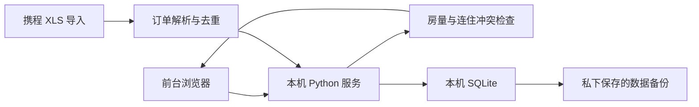

# 卡秀商务酒店 · Kasho Hotel

**让小酒店前台一眼看清房间、预订与房费。**

酒店宣传网页 + 本机前台系统 · 13 间客房 · Python / SQLite / 原生 JavaScript

[快速开始](#快速开始) · [前台工作流](#前台工作流) · [结构](#项目结构) · [验证](#验证与数据保护)

酒店位于青海省玉树藏族自治州囊谦县。本项目记录一套围绕实际前台操作逐步完善的小型系统。

## 前台工作流

| 日常操作 | 系统提供的支持 |
|---|---|
| 看今日、昨日或其他日期 | 按房型显示房号、状态、备注与房量 |
| 登记和修改 | 记录携程、美团、线下来源及房费，支持编辑、删除和批量操作 |
| 接待多晚入住 | 按完整入住到离店日期检查房间冲突 |
| 调整预订房号 | 对未入住的预订检查全程可用房间，再执行换房 |
| 导入携程订单 | 根据订单号去重，为无冲突订单分房并写入姓名备注 |
| 处理取消和减房 | 更新本机保留间数，释放关联房量 |
| 对账 | 线上与线下分别汇总，金额用整数分计算 |
| 避免超卖 | 显示满房日期和房型，由前台核对平台并关房 |

**空房号不一定等于可售房量。** 尚未分配房号的平台订单也会占用对应房型库存。例如显示两个未分配房号、另有一间待分房订单时，可售房量只有一间。

系统不会自动登录携程、美团或修改平台库存。美团远期订单目前需要手工登记。

## 快速开始

### 宣传网页

打开根目录 [index.html](index.html) 即可预览，支持手机和电脑布局。对外使用前，补充实际订房联系方式，核对地址与照片。

### 前台程序

Windows 安装 Python 3.10 或更高版本后，双击 [启动前台.cmd](启动前台.cmd)。也可从项目根目录运行：

```sh
python frontdesk/server.py
```

浏览器访问 `http://127.0.0.1:8765/`。详细步骤见 [简单版使用说明](frontdesk/简单版使用说明.md)。

程序只监听本机地址，营业数据保存在 `frontdesk/data/`。从 GitHub 下载的是源码，不包含 Python 运行时或酒店营业记录。

## 房型与默认房价

| 房型 | 房号 | 默认每间每晚 |
|---|---|---:|
| 标准间 | 8302、8802、8806、8808 | ¥196.24 |
| 大床房 | 8306、8308 | ¥178.64 |
| 高级观景 | 8801 | ¥284.24 |
| 舒适观景 | 8303、8305、8307、8803、8805、8807 | ¥266.64 |

默认房价用于辅助录入，不代表平台成交价或实际到账。人工修改的金额和确认的付款会保留；新导入记录仍需核对实际付款。离店日不占当晚房量。

## 项目结构



| 文件或目录 | 作用 |
|---|---|
| [index.html](index.html)、[assets/](assets/) | 酒店宣传网页与展示图片 |
| [frontdesk/server.py](frontdesk/server.py) | 本地服务、数据存储和接口 |
| [frontdesk/inventory.py](frontdesk/inventory.py) | 房量、订单及分房逻辑 |
| [frontdesk/ctrip_xls.py](frontdesk/ctrip_xls.py) | 携程导出表解析 |
| [frontdesk/web/](frontdesk/web/) | 前台浏览器界面 |
| [frontdesk/tests/](frontdesk/tests/) | 业务规则和界面回归检查 |

## 最近的业务规则更新

2026-09-29：取消或删除关联房号时同步释放本机订单房量；可修改“保留几间”、取消单间并补全分房；旧表重导不恢复本机已取消的间数。连住按完整订单日期处理，无冲突时补齐短记录，冲突明确提示。已入住记录不会因导入取消而自动抹除。

## 验证与数据保护

```sh
python -m unittest discover -s frontdesk/tests -p "test_*.py"
```

如需验证自己的携程样本，将环境变量 `KASHO_CTRIP_SAMPLE` 指向本地文件；不要提交该样本。页面回归入口见 [run_ui_regressions.cjs](frontdesk/tests/run_ui_regressions.cjs)，需要配置 Playwright 和浏览器环境。

换电脑或升级前先导出备份，关闭旧程序，再单独、安全地迁移 `frontdesk/data/`。保留原目录直到确认新程序的数据完整。

公开仓库用于分享源码与酒店展示素材。真实客人姓名、订单、营业数据库、备份、核账表和安装包不应提交到仓库。测试与演示请使用虚构记录。
